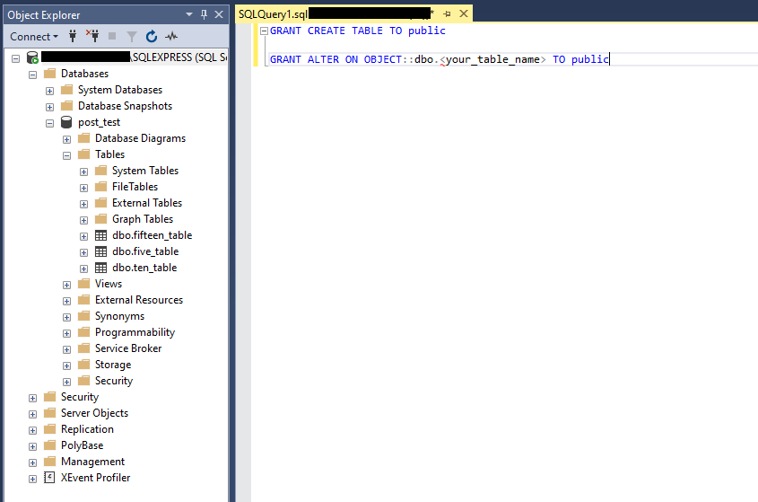

# Dynamic Post Request - Response to SQL

This project uses a combination of python script and .csvs to make dynamic POST requests and aggrigate the JSON responses into a SQL table.  This was built for a very specific client use case and likely has limited ability to be repurposed without code modifications.  To be sure check the [SampleRequestBody.json](Assets/sampledata/SampleRequestBody.json) and the [SampleResponse.json](Assets/sampledata/SampleResponse.json) files to see whether the schema matches your API.

The script used is not a plug-n-play.  There are a number of variables you'll need to be sure to update in the [postunixtosql.py](postunixtosql.py) file.  All of these required updates are called out in this tutorial.

## Prerequisites

* Download and install the latest version of [Python](https://www.python.org/downloads/).

* Download and install [Python Pip](https://pypi.org/project/pip/).

* Install the following Pip libraries (command line `pip install <library>`):
  * [pandas](https://pandas.pydata.org/docs/user_guide/index.html)
  * os.path
  * pyodbc

* Install [MS SQL](https://www.microsoft.com/en-us/sql-server/sql-server-downloads) or similar SQL RDB.

## Getting Started

First find a suitable file location for your `postunixtoSQL.py` script.  I'd recommend an empty folder on your `C:` drive.  This script will automatically generate the [objects.csv](Assets/sampledata/objects.csv) and various `_responses.csv` files in the Assets folder nested within the same folder as your script (unless you modify the file paths in the code).  You'll want to make sure the rest of that folder is empty as not to confuse yourself.


.
.
.

## Create SQL DB & Table

Let's get the SQL environment ready where we'll be storing and aggrigating your API response data.  Currently this script requires public access to the database and the tables must be created in advance--both of these requirements may change in the future.

First create a table for each time range.  Right now these are for 5, 10, and 15 minutes but this is subject to change.

`CREATE TABLE` - One for each of the following:
 * five_table
 * ten_table
 * fifteen_table

```
CREATE TABLE <YourTable> 
  ( 
     Objects VARCHAR(100) NULL, 
     Service_Level  VARCHAR(100) NULL, 
     CurrNumberWaitingCalls   VARCHAR(100) NULL, 
     Total_Calls_Answered  VARCHAR(100) NULL,
	 Total_Abandoned  VARCHAR(100) NULL
  )
```

Once you're tables are created, use the following scripts to grant public access to write back to each sql table.

```
GRANT CREATE TABLE TO public

GRANT ALTER ON OBJECT::dbo.<your_table_name> TO public
```


