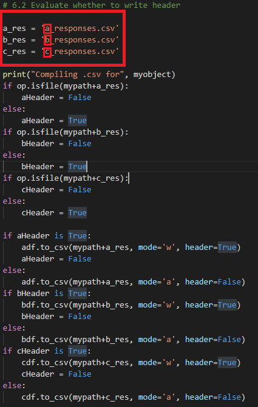

# Dynamic Post Request - Write Response to SQL

This project uses a combination of python script and .csvs to make dynamic POST requests and aggrigate the JSON responses into a SQL table.  This was built for a very specific client use case and likely has limited ability to be repurposed without code modifications.  To be sure check the [SampleRequestBody.json](Assets/sampledata/SampleRequestBody.json) and the [SampleResponse.json](Assets/sampledata/SampleResponse.json) files to see whether the schema matches your API.

The script used is not a plug-n-play.  There are a number of variables you'll need to be sure to update in the [postunixtosql.py](postunixtosql.py) file.  All of these required updates are called out in this tutorial.

**NOTE:** This script is intended for use on Windows OS.  Would likely require a multitide of code changes to be compatible with a non-Windows OS.

## Prerequisites

* Download and install the latest version of [Python](https://www.python.org/downloads/).

* Download and install [Python Pip](https://pypi.org/project/pip/).

* Install the following Pip libraries (command line `pip install <library>`):
  * [pandas](https://pandas.pydata.org/docs/user_guide/index.html)
  * os.path
  * pyodbc

* Install [MS SQL](https://www.microsoft.com/en-us/sql-server/sql-server-downloads) or similar SQL RDB.

## What this Script Does

This script is used to address the complex requirements in the JSON body of this POST request.


The fields underlined in red are our primary focus but we'll address all the fields going from left to right.

### Object Name

For our usecase we need to gather client data across a number of different locations, called out as `objectname`.  Unfortunately the request we're working with requires the specific object to be listed in the JSON body of the post request (`"objectname":["<yourobjectname>"]}`), you can't just make a request to gather all data for all objects.


To solve for this requirement the [postunixtosql.py](postunixtosql.py) script pulls from a spreadsheet of user-defined object names and makes requests for each.  This allows for the user to define the specific objects they want to aggregate on the fly.

By default this script uses Four Winds Interactive's FWI Cloud Tables (essentially online .csv) functionality.  If you're a non-FWI user you can simply comment out the `csv_url` and the entirety of section 5. in the script.  You'd then be able to update the [objects.csv](Assets/objects.csv) in the Assets folder to define your list of objects.

### Unix Times

The next fields to solve for are the `from` and `to` unix times required in the JSON body.

EXAMPLE: 

This POST request requires us to define the exact time range for which we want to see data.  This script defaults to three time ranges: 5, 10, and 15 minutes but these can easily be adjusted in section 3 (will explain further below).  You can also use the [postunixtosql_single.py](Assets/Unused/postunixtosql_single.py) script in the Assets/Unused folder if you only want metrics for a single time range.

### Metric Names

Finally the POST request allows you to define the specific metrics for which you want to pull data for each object.  While you can adjust these using the `metric_names` variable in section 2, you'll also need to update the SQL query in the `myscript` variable at the bottom of section 7 (explained further below).

EXAMPLE: 

## Getting Started

First find a suitable file location for your `postunixtoSQL.py` script.  I'd recommend an empty folder on your `C:` drive.  This script will automatically generate the [objects.csv](Assets/sampledata/objects.csv) and various `_responses.csv` files in the Assets folder nested within the same folder as your script (unless you modify the file paths in the code).  You'll want to make sure the rest of that folder is empty as not to confuse yourself.

## Create SQL DB & Table

Let's get the SQL environment ready where we'll be storing and aggrigating your API response data.  Currently this script requires public access to the database and the tables must be created in advance--both of these requirements may change in the future.

First create a table for each time range.  Right now these are for 5, 10, and 15 minutes but this is subject to change.

`CREATE TABLE` - One for each of the following:
 * a_table
 * b_table
 * c_table

```
CREATE TABLE <YourTable> 
  ( 
     Objects VARCHAR(100) NULL, 
     Service_Level  VARCHAR(100) NULL, 
     CurrNumberWaitingCalls   VARCHAR(100) NULL, 
     Total_Calls_Answered  VARCHAR(100) NULL,
	 Total_Abandoned  VARCHAR(100) NULL
  )
```

Once you're tables are created, use the following scripts to grant public access to write back to each sql table.

```
GRANT CREATE TABLE TO public

GRANT ALTER ON OBJECT::dbo.<your_table_name> TO public
```


## Updating the variables

With your SQL tables we can go ahead and configure the script.  Open up the [postunixtosql.py](postunixtosql.py) and navigate to the `Global Variables` section.  They should be mostly self explanitory but I'll provide full descriptions below.


**NOTE:** The first three variables require adjustment for the script to work, the rest are optional.

### `csv_url` (Adjustment Required)

The `csv_url` variable requires the .csv Content Manager link from FWI Cloud for your Objects Table.  If you don't already have this table created, you can simply upload the [objects.csv](Assets/objects.csv) as a Table.

As previously mentioned, if you don't plan on using an FWI Cloud table, you can just as easily use comment out this variable and all of section 5 and simply update the [objects.csv](Assets/objects.csv) in the Assets folder.

### `post_url` (Adjustment Required)

The `post_url` variable is simply the http/https address of the API you're making POST requests to.

### `conn` (Adjustment Required)

The `conn` variable opens up the connection to your SQL database.  By default this script assumes it's running on the same machine as your SQL server and you've granted public write access as documented in the section above.  

If your SQL server database has remote and/or credential requirements, you can comment out this variable and uncomment the `conn` below.  It "should" work but I haven't fully tested it so you may need to adjust some of the code on your own (probably start with the `pyodbc.connect` documentation.

Assuing you're using the default script you'll only need to update two fields:

* Update `Server=<YOURSQL>\SQLEXPRESS;` with your Server name.
* Update `Database=<YOURDB>;` with your database name.

### `metric_names` (Adjustment Optional)

The `metric_names` variable allows you to define the specific metrics you want to see data with each object.  This variable simply appends to the JSON body of your POST request.

As previously mentioned, if you choose to modify this list your will also need to update the SQL query inside the `myscript` variable in section 7.  I would discourage anyone not versed in SQL queries from making adjustments here.

### `myfileheaders` (Adjustment Optional)

The `myfileheaders` variable appends a unique identifier at the front of the different time range .csvs and SQL tables.

It's extremely important to note, if you want to change this naming convention you will also need to modify additional portions of code.  Specifically:

You'll need to change the `if` conditions for each dataframe at the bottom of section 6.1.

```
if x == "<your_new_fileheader_a>":
... "<your_new_fileheader_b>"
... "<your_new_fileheader_c>"
```


You'll also need to adjust all the `_responses.csv` for each `_res` variable in section 6.2 to evaluate the approriately named .csv.

```
a_res = '<your_first_new_fileheader>_responses.csv'
b_res = '<your_second_new_fileheader>_responses.csv'
c_res = '<your_third_new_fileheader>_responses.csv'
```



Finally, you'd need to create new tables in your SQL server to match the new file header names you'd designated.

### `mypath` (Adjustment Optional)

The `mypath` variable simply points to the Assets folder in your current working directory.  It's highly unlikely that you'll ever need to adjust this variable.

## Running the script

With your variables adjusted you should be able to run your script and see the results.  Open a command line, `cd` to the appropriate directory, and run the script `python postunixtosql.py`.

If everything is configured correctly, you should get a successful execution script similar to [this](Assets/sampledata/successfulexecute.txt).


